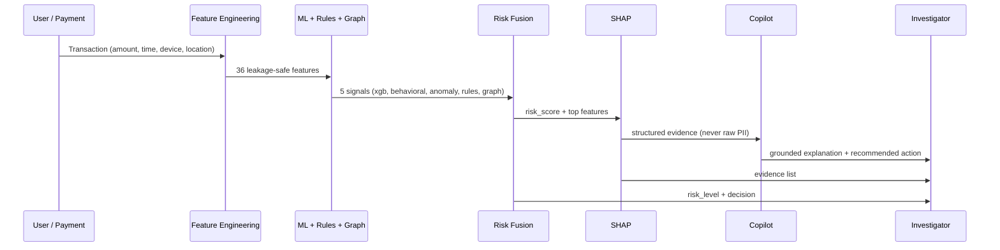

# Finsheild — Hybrid AI-Powered Digital Payment Fraud Detection & Investigation Platform

> **Research-first fraud intelligence.** Hybrid architecture: XGBoost + behavioral + anomaly + rules + graph → risk fusion → SHAP → LLM copilot. Real ULB benchmark: **XGBoost ROC 0.9709 PR 0.8418**.

[](pyproject.toml)
[](tests/)
[](LICENSE)
[](notebooks/colab/01_dataset.ipynb)

---

## 1. What is Finsheild?

Finsheild is a **hybrid fraud intelligence platform** for digital payments. It does not rely on a single model. Instead, it fuses five independent signals — supervised, behavioral, anomaly, rule, graph — into a calibrated risk decision, explains it with SHAP, and lets an LLM copilot *explain* (not decide).

**Core principle:**
```text
LLM is an investigation layer — never the source of truth for the fraud score.
```

**Current scope:** All 16 phases of `Finsheild - ML-FIRST DEVELOPMENT PLAN.md` are implemented. The user-facing app is a demo presentation layer (`app/`).

---

## 2. Architecture

```mermaid
flowchart TD
    TX[Transaction<br/>amount, time, merchant, device, location] --> FE[Feature Engineering<br/>36 cols: transactional / behavioral / velocity / device / location<br/>no leakage, ts < t only]

    FE --> XGB[XGBoost<br/>500 trees, PR-AUC early stopping]
    FE --> BEH[Behavioral Profiling<br/>per-user mean/std, hour histogram, frequency]
    FE --> RUL[Rule Engine<br/>8 rules: velocity, new device, location, amount, shared device]
    FE --> ANO[Anomaly Detection<br/>IsolationForest on legit, 0.05 contamination]
    FE --> GRP[Graph Intelligence<br/>NetworkX: user↔account↔device↔merchant]

    XGB --> FUS
    BEH --> FUS
    RUL --> FUS
    ANO --> FUS
    GRP --> FUS

    FUS[Risk Fusion<br/>weighted: XGB 0.35 + anomaly 0.20 + behavioral 0.15 + graph 0.10 + rule 0.20<br/>GREEN <0.3 < YELLOW <0.7 < RED<br/>APPROVE / STEP_UP / BLOCK / INVESTIGATE]

    FUS --> SHAP[SHAP Explainability<br/>TreeExplainer, fallback to importances<br/>grounded: never invents evidence]
    SHAP --> LLM[LLM Investigation Copilot<br/>Qwen2.5-0.5B-Instruct + QLoRA r=8<br/>input: structured evidence → output: {risk_level, fraud_type, evidence}]
    SHAP --> DEC[Investigator Decision]
    LLM --> DEC

    DEC --> PRIV[Privacy Identity Layer<br/>prototype tokenization: salted SHA-256<br/>NOT zero-knowledge proof]

    style XGB fill:#11161f,stroke:#3fb950
    style FUS fill:#1f2733,stroke:#f85149
    style LLM fill:#11161f,stroke:#8b5cf6
    style PRIV fill:#0a0e14,stroke:#d29922
```

### Data Flow



---

## 3. Datasets

| Dataset | Rows | Fraud | Rate | Purpose |
|---|---|---|---|---|
| **Real ULB** (Kaggle `mlg-ulb/creditcardfraud`) | 284,807 | 492 | **0.17%** | Primary benchmark — real European card transactions, PCA V1-V28 |
| Synthetic Easy | 6,158 | 709 | 11.5% | Too separable — extreme values |
| Synthetic 1% Diluted | 8,540 | 91 | 1.07% | Class-balance stress |
| **Synthetic Hard Overlap** | **9,100** | **100** | **1.10%** | **Feature-overlap stress — weak signals, realistic overlap** |

Synthetic hard overlap: `seed=1729`, 9000 background + 5×20 fraud (`hard_moderate_amo_dev`, `hard_normal_amount_new_device_merchant`, `hard_high_amount_normal_location_velocity`, `hard_normal_amount_normal_device_merchant`, `hard_mixed_signals`). Background legit now overlaps: 10% new device (was 0%), 20% high-risk merchant (was 6%), 30% foreign travel.

> All synthetic is **simulated** — does not represent real banking behavior.

---

## 4. Model Performance

### Real ULB Benchmark (holdout 42,722, 74 fraud, threshold 0.5, 70/15/15 split, scaler fit on train only)

| Model | ROC-AUC | PR-AUC | F1 | Precision | Recall | Confusion @0.5 | Lift |
|---|---|---|---|---|---|---|---|
| Logistic Regression | 0.9495 | 0.7005 | 0.7407 | 0.8197 | 0.6757 | TN 42637 FP 11 FN 24 TP 50 | 404× |
| **XGBoost (200 trees, primary)** | **0.9709** | **0.8418** | **0.8467** | **0.9206** | **0.7838** | **TN 42643 FP 5 FN 16 TP 58** | **486×** |

Source: `evaluation/reports/{baseline,xgboost}_metrics.json` — never mixed with synthetic. Lift vs random (0.17% baseline).

### Synthetic Robustness (XGBoost, PR-AUC primary, same 500-tree config)

| Dataset | Fraud Rate | XGB PR-AUC | Interpretation |
|---|---|---|---|
| Easy Synthetic | 11.5% | **0.959** | Too separable — extreme amounts/velocity |
| 1% Diluted | 1.07% | **0.553** | Class-balance stress only |
| **Hard Overlap** | **1.10%** | **0.373** | **Feature-overlap stress — 33.9× lift, overlapping distributions** |
| Real ULB | 0.17% | **0.842** | Real benchmark — stronger signals than hard synthetic |

**Experiment story:**

```mermaid
flowchart LR
    A[Easy: separable] --> B[1% Diluted: harder]
    B --> C[Hard Overlap: realistic overlap]
    C --> D[Real ULB: true benchmark]
    style A fill:#1f2733
    style C fill:#d29922,color:#000
    style D fill:#3fb950,color:#000
```

PR should drop easy→diluted→hard as overlap increases. Hard (0.373) is intentionally harder than real (0.842) to test robustness — synthetic is heuristic, not calibrated.

### Feature Separability (Hard Overlap, fraud within legit IQR)

- `is_new_device`: legit 10.6% vs fraud 45% → **4.3×** (was 450k× before fix)
- `is_high_risk_merchant`: legit 19.8% vs fraud 23% → **1.2×** (was 13.8×)
- `country_switch`: legit 40.5% vs fraud 26% → **0.6×** (fraud *less* likely to switch — good overlap)

Histograms: `evaluation/figures/synthetic_hard_overlap_numerical_overlap.png`

---

## 5. Project Structure

```text
Finsheild/
├── README.md, AGENTS.md, pyproject.toml
├── config/dataset.yaml, docs/{dataset.md,synthetic_env_schema.md,synthetic_hard_overlap.md}
├── data/{raw/creditcard.csv (gitignored), processed/, synthetic_env/}
├── src/finsheild/
│   ├── data/         # loader, FraudPreprocessor (fit on train only), splits (stratified)
│   ├── model.py      # registry: logreg, xgboost (500 trees), lightgbm
│   ├── features/     # 36 leakage-safe cols (transactional, behavioral, velocity, device, location)
│   ├── behavioral/   # per-user profiles + deviation scoring
│   ├── anomaly/      # IsolationForest (0.05 contamination, trained on legit only)
│   ├── rules/        # 8 configurable rules with severity
│   ├── graph/        # NetworkX: degree, shared-device, suspicious neighbor
│   ├── risk_fusion/  # weighted 5-signal → GREEN/YELLOW/RED + APPROVE/STEP_UP/BLOCK/INVESTIGATE
│   ├── explain/      # SHAP TreeExplainer + grounded evidence
│   ├── synthetic_env/{entities, transactions, scenarios, scenarios_hard, environment, environment_hard}
│   ├── llm_data/     # evidence→JSON copilot dataset (80/10/10)
│   ├── llm_eval/     # base eval (mock + real Qwen path)
│   ├── finetune/     # QLoRA r=8, 4-bit auto on CUDA, checkpoint resume
│   ├── compare_llm/  # base vs finetuned comparison
│   └── export/       # export_all → models/{baseline,xgboost,anomaly,risk_fusion,llm/adapter}
├── tests/            # 202 tests (hard overlap 6, synthetic 25, data pipeline, full ML)
├── app/
│   ├── backend/      # FastAPI, adapters (RealMLAdapter live with 36-feature XGB + scaler)
│   └── frontend/     # React + Vite + Tailwind, dark cyber, DEMO SIMULATION labels
├── notebooks/colab/{01_dataset.ipynb, 02_hard_overlap_synthetic.ipynb}
├── scripts/{download_dataset.py, generate_synthetic_env.py, fetch_repo.py, run_hard_overlap_experiment.py}
└── evaluation/{reports/*.json/*.md, figures/*.png}
```

---

## 6. Quickstart

### Local (CPU, lightweight)

```bash
python3 -m venv .venv && source .venv/bin/activate
pip install -r requirements.txt && pip install -e ".[dev]"

# Dataset (real ULB needs Kaggle creds, else synthetic fallback)
python scripts/download_dataset.py              # real via kagglehub
python scripts/download_dataset.py --synthetic --n 5000  # fallback

# Train
python -m finsheild.train --model logreg    # → models/baseline/
python -m finsheild.train --model xgboost   # → models/xgboost/ (500 trees)

# Synthetic hard overlap
PYTHONPATH=src python scripts/run_hard_overlap_experiment.py  # → evaluation/reports/synthetic_hard_overlap_*

# Tests
pytest tests/ -q  # 202 tests

# Demo app (backend :8000 + frontend :5173)
./start.sh
# → http://127.0.0.1:5173 (Command Center) → Generate Suspicious → Investigate → SHAP → Graph → Copilot
```

### Colab (heavy training, GPU)

```python
# In Colab, open notebooks/colab/02_hard_overlap_synthetic.ipynb
# Runtime → T4 GPU → Run all (Cell 2 installs, Cell 3 generates hard overlap 9100 rows)
# Or CLI:
# colab run scripts/run_hard_overlap_experiment.py --gpu T4 --timeout 1800
```

**Colab-only rule:** All GPU training (XGBoost large, QLoRA) must run in Colab. Local never downloads CUDA/bitsandbytes/LLM weights.

---

## 7. API

```text
GET  /api/health                    → {status, adapter: real|mock, model_status}
GET  /api/model/metrics             → REAL_BENCHMARK (xgb 0.9709/0.8418) + synthetic_experiments
POST /api/transactions/generate?scenario=normal|suspicious|fraud_ring|ambiguous
GET  /api/transactions              → DEMO_SIMULATION list
GET  /api/transactions/{id}
POST /api/investigation/explain     → {risk_level, fraud_type, summary, evidence, recommended_action} (never sets risk score)
GET  /api/graph/{txn_id}            → DEMO_SIMULATION nodes/edges
GET  /api/identity/{user_id}        → {token, phone_masked, method: "Prototype tokenization — NOT zero-knowledge"}
POST /api/demo/reset
```

Adapters: `app/backend/adapters/real_adapter.py` (live XGB 36-feature) ↔ `mock_adapter.py` (deterministic fallback). UI shows `LIVE_MODEL` vs `DEMO_FALLBACK` honestly.

---

## 8. Demo Mode (Judge Flow, 10 steps)

1. **Dashboard** → system/model status, XGB 0.9709, `LIVE_MODEL`
2. **Start** live stream → transactions appear 1.8s
3. **Generate Suspicious** → `TXN-… HIGH` alert (₹50k, new device, 8 velocity, 400km)
4. **Investigate** → Transaction + Risk (fused 0.6-0.9) + Evidence + `INVESTIGATE`
5. **SHAP** → red (fraud) / green (legit) bars, actual contributions
6. **Fraud Ring** → `Generate Fraud Ring` → graph shows device X shared by 4 accounts (red)
7. **Copilot** → `Run explanation` → structured JSON, `DEMO_FALLBACK`
8. **Privacy** → `U-00001` → salted hash token, masked phone
9. **Performance** → Real ULB vs Easy→Diluted→Hard story
10. **Architecture** → full pipeline diagram

One-click scenarios: `normal` (LOW), `suspicious` (HIGH), `fraud_ring` (HIGH+graph), `ambiguous` (MEDIUM, subtle).

---

## 9. Evaluation Methodology

- **ULB:** stratified 70/15/15 seed 42, scaler `StandardScaler` fit on train only, threshold 0.5 for F1, 1% FPR tuned on val, PR-AUC primary (imbalanced).
- **Synthetic:** same splits/scaler/threshold, 36 features, XGB 500 trees fixed, no tuning to recover metric.
- **Leakage audit:** `label_fraud` never in feature cols, no `fraud_device` or `fraud_merchant`, amount/velocity/location overlap verified via histograms (fraud in legit IQR).

---

## 10. Tech Stack

- **ML:** scikit-learn, XGBoost, LightGBM, IsolationForest, NetworkX, SHAP, pandas, joblib
- **LLM:** Qwen2.5-0.5B-Instruct, PEFT LoRA r=8, TRL SFTTrainer, bitsandbytes 4-bit (GPU auto), transformers
- **App:** FastAPI, React + TypeScript + Vite + Tailwind, React Router
- **Infra:** uv, hatchling, pytest, kagglehub, Colab CLI `colab` (0.6.0), Drive for artifacts

---

## 11. Limitations & Next

- Synthetic is **heuristic**, not real banking — amount lognormal, not calibrated to ULB.
- Hard overlap PR 0.373 < Real 0.842 suggests synthetic is *harder* than real — intentional stress, not a claim.
- LLM adapter is **mock** (21-byte dummy) — real QLoRA needs Colab T4 run (`train_lora` with `Qwen2.5-0.5B`, 1 epoch, 50 samples for test, full on T4).
- Next: run LLM QLoRA on T4, evaluate base vs finetuned on same holdout (JSON validity, fraud_type accuracy), then wire `app/backend` copilot to real adapter.

---

## 12. License

MIT — see `LICENSE`.

```

